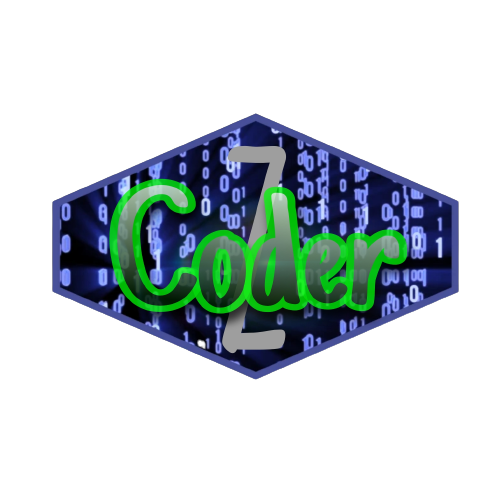

# ZBot - Discord Bot for Project Management and Developer Collaboration

)

ZBot is a versatile Discord bot designed to streamline project management, ticketing, developer collaboration, and more. It comes with a set of features tailored to enhance your server's productivity and organization.

## Features

### 1. Project Management
- Create, track, and manage projects seamlessly within your Discord server.
- Assign tasks, deadlines, and collaborate with your team effortlessly.

### 2. Ticket System
- Efficient ticketing system for handling user queries, support requests, or bug reports.
- Keep track of open tickets and provide timely responses to your community.

### 3. Developer Management System
- Register and manage developers within your Discord community.
- Assign roles, track contributions, and maintain a developer database.

### 4. PayPal Integration
- Automated PayPal API for triggering project management and ticket system actions.
- Streamline payment processing and project updates with PayPal transactions.

### 5. Welcome Message
- Warmly welcome new users to your server with a customized welcome message.
- Set the tone for a positive and engaging community experience.

### 6. PayPal Webhook Receiver
- Receive PayPal webhooks to trigger the PayPal API for fetching detailed invoice information.
- Keep your financial records up-to-date with automatic webhook handling.

### 7. Developer Statuses System
- Allow developers to set their availability status (available, unavailable, busy, on leave).
- Enhance collaboration by providing real-time information about team members.

### 8. Command and Error Logging
- Log executed commands for auditing and analytics.
- Capture and log errors for efficient debugging and issue resolution.

## Getting Started

ZBot is currently only available to CoderZ.

## Usage

Please read the contained UserGuide.md or DeveloperGuide.md

## Support and Feedback

For assistance, bug reports, or feature requests, please open an issue.

## Contributing

We welcome contributions! Fork the repository, make your changes, and submit a pull request.
